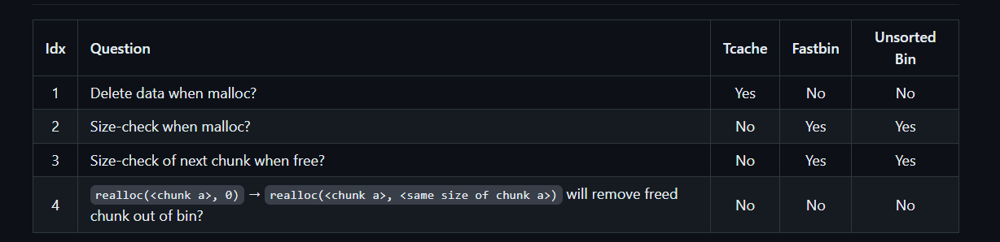

# House of Orange

## Introduction

- House of Orange là một kĩ thuật được lần đầu đưa vào CTF ở giải Hitcon CTF 2016. Kĩ thuật này gắn liền với libc 2.23, các libc sau đã vá lỗ hổng.
- Điểm đặc biệt của kĩ thuật này là chúng ta không cần hàm free nhưng vẫn có thể đưa một chunk vào unsorted bin

## Principle

- Hướng khai thác sẽ là cố gắng malloc một chunk với size lớn hơn size top chunk, khi này chương trình sẽ free top chunk.
- Đầu tiên, khi `malloc` được call, chương trình sẽ thực thi `_int_malloc` trong libc.

```c
...
if ((unsigned long) (size) >= (unsigned long) (nb + MINSIZE))
...
/* When we are using atomic ops to free fast chunks we can get
   here for all block sizes.  */
else if (have_fastchunks (av))
...
else
{
    void *p = sysmalloc (nb, av);
    if (p != NULL)
    alloc_perturb (p, bytes);
    return p;
}
```

- Với các chunk bé hơn 128KB sẽ được ptmalloc2 dùng phương thức `brk`('break point' - thay đổi vùng nhớ heap). Với các chunk lớn hơn 128KB sẽ dùng sysmalloc với phương thức `mmap` (cấp phát bộ nhớ vào một vùng nhớ khác heap)
- Ở kĩ thuật này, ta sẽ sử dụng brk để cấp phát. Tuy nhiên cần bypass một số check trong libc.
- Đầu tiên, size của malloc không được lớn hơn `mmp_.mmap_threshold`. Mục đích là để chương trình không sử dụng mmap call

```c
  if (av == NULL
      || ((unsigned long) (nb) >= (unsigned long) (mp_.mmap_threshold)
	  && (mp_.n_mmaps < mp_.n_mmaps_max)))
    {
        char *mm;           /* return value from mmap call*/
        ...
```

- Thứ hai, bypass check của top chunk size

```c
assert((old_top == initial_top(av) && old_size == 0) ||
     ((unsigned long) (old_size) >= MINSIZE &&
      prev_inuse(old_top) &&
      ((unsigned long)old_end & pagemask) == 0));
```

```
Let's summarize the requirements for forged top chunk size

    Forged size must be aligned to the memory page
    size is greater than MINSIZE (0x10)
    size is smaller than the chunk size + MINSIZE (0x10) applied afterwards
    The prev inuse bit of size must be 1
```

- Tất cả điều kiện 2 3 4 ta đều có thể thoả mãn, chỉ có điều kiện 1 là ta cần ghi lại theo ví dụ sau, (size top chunk = 0xabcd, ta cần ghi giữ nguyên 0x_bcd)
- Sau khi ow top chunk, ta cần malloc một chunk có size lớn hơn size top chunk
- Khi này chương trình sẽ nhầm lẫn top chunk là một unsorted bin(cơ bản top chunk là một unsortedbin) và vì size của top chunk không đủ nên ptmalloc2 theo phương thức brk sẽ malloc một chunk ngay sau top chunk.

```
Before:
          |------------|------------|------...----|
          |    chunk   |    chunk   | Top  ...    |
          |------------|------------|------...----|
      heap start                              heap end

After:                                         v chunk malloc > top chunk
          |------------|------------|------..--|--...--|---------|
          |    chunk   |    chunk   | Top  ..  |  ...  | new Top |
          |------------|------------|------..--|--...--|---------|
     heap start                            heap end
```

- Sau khi ta tạo 1 unsorted bin, ta có thể leak libc, heap từ unsorted [link](https://github.com/nhtri2003gmail/CTFNote/tree/master/Heap-Exploitation)
  
- Khi này nếu ta malloc thêm 1 chunk nữa sẽ báo lỗi (abort)
- Khi call abort, nó sẽ xoá các file pointer bằng `_IO_flush_all_lockp -> _IO_list_all x> _IO_OVERFLOW (vtable)`
- Nếu ta có thể thay đổi `_IO_list_all` thành system() or one_gadget

```
`_IO_flush_all_lockp` -> `_IO_list_all` x> `_IO_OVERFLOW` (vtable)
                            |
                            |------------> fake file structure

```

- Khi này ta sử dụng unsorted bin attack, thay bk bằng `_IO_list_all` - 0x10 để khi malloc một chunk mới, nó ow địa chỉ `_IO_list_all`
- Tuy nhiên để fsop ta cần bypass một số check sau

```
fp->_mode <= 0 && fp->_IO_write_ptr > fp->_IO_write_base
```

- Do mình sử dụng `FileStructure` trong pwntool nên mode đã được set -1, write_ptr > write_base <=> 3 > 2 và \_IO_OVERFLOW calls the ptr at offset 3

## Reference

[how2heap](https://github.com/shellphish/how2heap/blob/master/glibc_2.23/house_of_orange.c)
[CTF Wiki EN](https://ctf-wiki.mahaloz.re/pwn/linux/glibc-heap/house_of_orange/)
